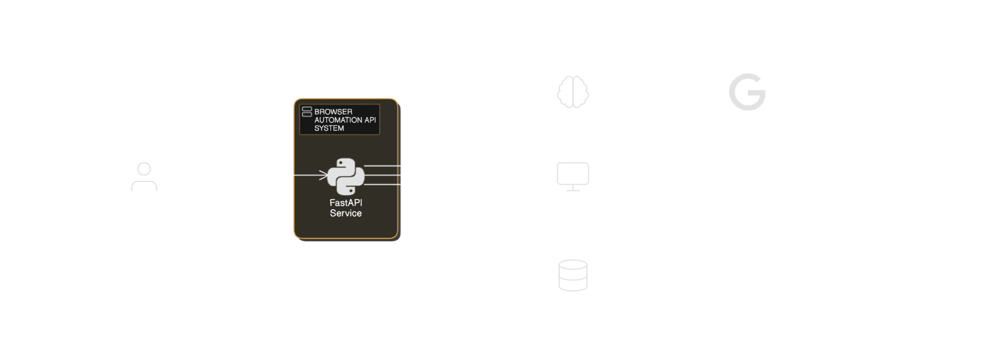

# Browser Automation API

A FastAPI-based service that combines browser automation with LLM-powered task execution and RAGFlow integration.

## Features

- Two-stage task processing:
  1. RAGFlow: Understands and refines user intent using context-aware LLM
  2. Browser Agent: Executes refined instructions with browser automation

## How It Works

1. User submits a task
2. RAGFlow processes the task with context awareness
3. Browser Agent receives refined instructions
4. Automation executes with real-time feedback
5. Results and screenshots are returned

## Quick Start

1. Set up environment variables:
```bash
GEMINI_API_KEY=your_key
RAGFLOW_API=your_api
RAGFLOW_API_KEY=your_key
RAGFLOW_DATASET_ID=your_id
RAGFLOW_CHAT_ID=your_id
```

2. Run with Docker:
```bash
docker-compose up
```

## API Endpoints

- `POST /api/execute-task`: Execute browser automation tasks
- `POST /api/v1/ragflow/completions`: Chat with RAGFlow
- `GET /api/v1/session/{session_id}/clean-screenshot`: Get browser screenshots
- `GET /health`: Health check endpoint

## Architecture

- FastAPI backend
- RAGFlow for context-aware task understanding
- Browser automation using custom browser-env
- Session management with Redis
- LLM integration via Google's Gemini

## Development

```bash
curl -LsSf https://astral.sh/uv/install.sh | sh

uv venv
source .venv/bin/activate  # or .venv\Scripts\activate on Windows

uv pip install -r requirements.txt

python api.py
```
